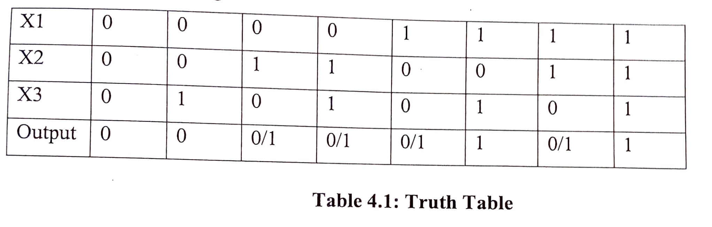
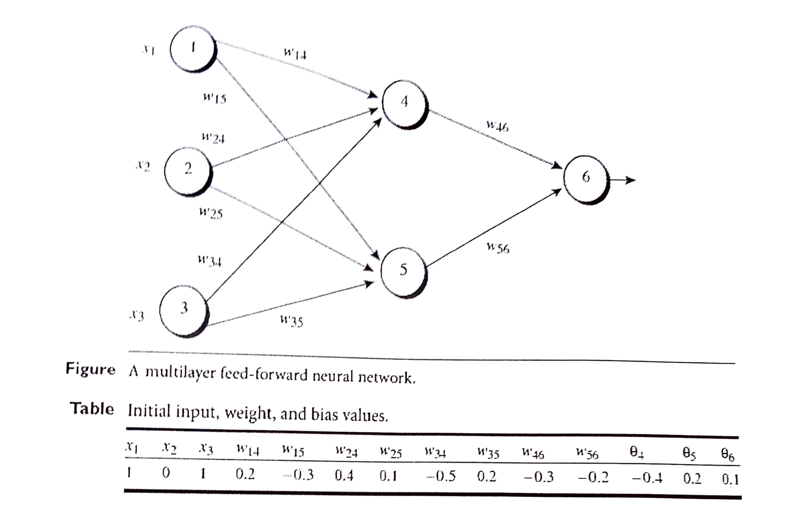

#### Question 1

a. Outline three (3) advantages of using neural networks over cxplicitly programmed solutions to solve today's problems.

b. Describe overfitting with the aid of a diagram.

c. Briefly explain any three types of supervised learning algorithms.

d. With a supervised learning algorithm, we can specify target output values, but we may never get close to those targets at the end of learning. Give 2 reasons why this might happen.

e. Write down the energy function of a discrete _Hopfield_ net

#### Question 2

a. Using logic gates and inequalities prove that a perceptron can only solve linearly separable problems.

b. Briefly explain the following terms.

    i. Neuroplasticity
    ii. Learning Rate
    iii. Network Stability
    iv. Hebbian Learning
    v. Non-linearity

c. Explain what feedforward means and why it is a necessary attribute for a neural network that learns by the backpropagation algorithm.

d. Why do we need an activation function in a neural network?

#### Question 3

a. Explain the architecture for each of the following Neural Networks describing the problem for which it is best suited:

    i. Radial Basis Function Networks (RBF)
    ii. Self-organizing Map (SOM)

b. Compare and constrast Recurrent Network and Hopfield network.

c. Discuss Deep Learning in Neural Networks

d. Highlight any three desirable attributes of a machine learning model.

#### Question 4

a. Briefly explain any four types of Activation functions used in Neural Networks.

b. Given a 3-input neuron which was taught to output 1 when the input (X1,X2,X3) is 111
or 101 and to output O when the input is 000 or 001.The table below shows the truth table before applying the firing rule:

Show the new table after applying the Firing rule, explaining each step in the process.

c. Define feature engineering.

d. Explain possible feature engineering techniques that are best in dealing with scenaries given below:

    i. Missing data in the dataset
    ii. Outliers in the dataset
    iii. Skewed data in the dataset

#### Question 5

a. Figure below shows a multilayer feed-forward neural network. Let the learning rate be 0.9. The initial weight and bias values of the network are given in the table below.

The first training tuple X (1, 0, 1) whose class label is 1. The network learns by backpropagation.

    i. Calculate the net input and output for nodes 4, 5 and 6.
    ii. Calculate the error for nodes 4, 5 and 6.
    iii. Calculate new weights and biases for the network

b. Explain the demerits of choosing a large learning rate in training neural networks. In which case(s) is a large learning rate desirable.

c. Neural networks require lots of data to be trained properly. If you have too little data (too few input-target pairs) the first thing to try is to get more. However, sometimes this is simply not possible and, then, to split up the few data you have in a training set and a test set might be considered wasteful. Describe how K-fold cross validation can be used to deal with this problem.
