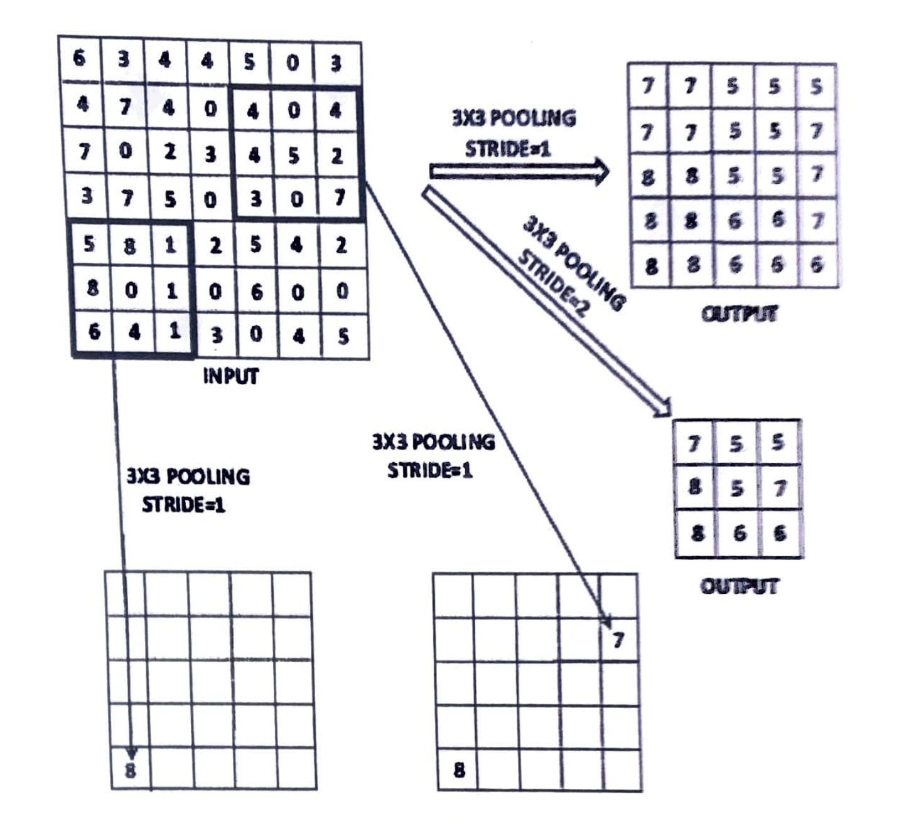

#### Question 1

a. Show the following properties of the sigmoid and tanh activation functions denoted by $\phi(v)$ in this case:

i. Sigmoid Activation: $\phi(-v) = 1 - \phi(v)$

ii. Tahn Activation: $\phi(-v) = -\phi(v)$

iii. Hard Tahn Activation: $\phi(-v) = -\phi(v)$

b. Discuss the effect of increasing the regularization parameter on the training and testing accuracy. Highlight the point at which training and testing accuracy become similar.

c. Consider a 1-dimensional time-series with values `2, 1, 3, 4, 7`: Perform a convolution with a 1-dimensional filter `1. 0. 1` and zero padding

#### Question 2

a. Discuss how the k-means algorithm is related to competitive learning.

b. Propose an approach for using RBMs for outlier detection.

c. Consider a two-player game like GANs with objective function f(x,y), and we want to compute minxmaxyf(x,y). Discuss the relationship between minxmaxyf(x,y) and maxyminxf(x,y). When are they equal?

#### Question 3

a. Consider the case of the XOR function in which the two points {(0,0),(1,1)} belong to one class, and the other two points {(1,0),(0,1)} belong to the other class. Show how you can use the ReLU activation function to separate the two classes in a manner similar to the example in the chapter.

b. Bob divided the labeled classification data into a portion used for model construction and another portion for validation. Bob then tested 1000 neural architectures by learning parameters (backpropagating) on the model-construction portition and testing its accuracy on the validation proportion.

    i. Discuss why the resulting model is likely to yield poorer accuracy on the out-of-sample test data as compared to the validation data, even though the validation data was not used for learning parameters.

    ii. What are you recommendations for Bob on using the results of his 1000 validations?

c. Neural networks require lots of data to be trained properly. If you have too little data (too few input-target pairs) the first thing to try is to get more. However, sometimes this is simply not possible and, then, to split up the few data you have in a training set and a test set might be considered wasteful. Describe how K-fold cross validation can be used to deal with this problem.

#### Question 4

a. Perform a `4x4` pooling at stride 1 of the input volume in the upper-left corner of Figure 1 below:

b. You are a Data Scientist for a local bank. You are required to design classifier that can predict whether a customer qualifies for a bank loan or not using any appropriate neural network. Use your discretion to come up with features (details provided by the applicant) you see fit for the system. Illustrate your answer with any appropriate neural network carry out the task.

c. With a supervised learning algorithm, we can specify target output values, but we may never get close to those targets at the end of learning. Give two reasons why this might happen.

#### Question 5

Explain the architecture for each of the following Neural Networks describing the problem for which it is best suited:

a. Radial Basis Function Networks (RBF)

b. Self-Organizing Map (SOM)

c. Restricted Boltzman Machine (RBM)

d. The Perceptron

e. A Multilayer Feedforward Network
